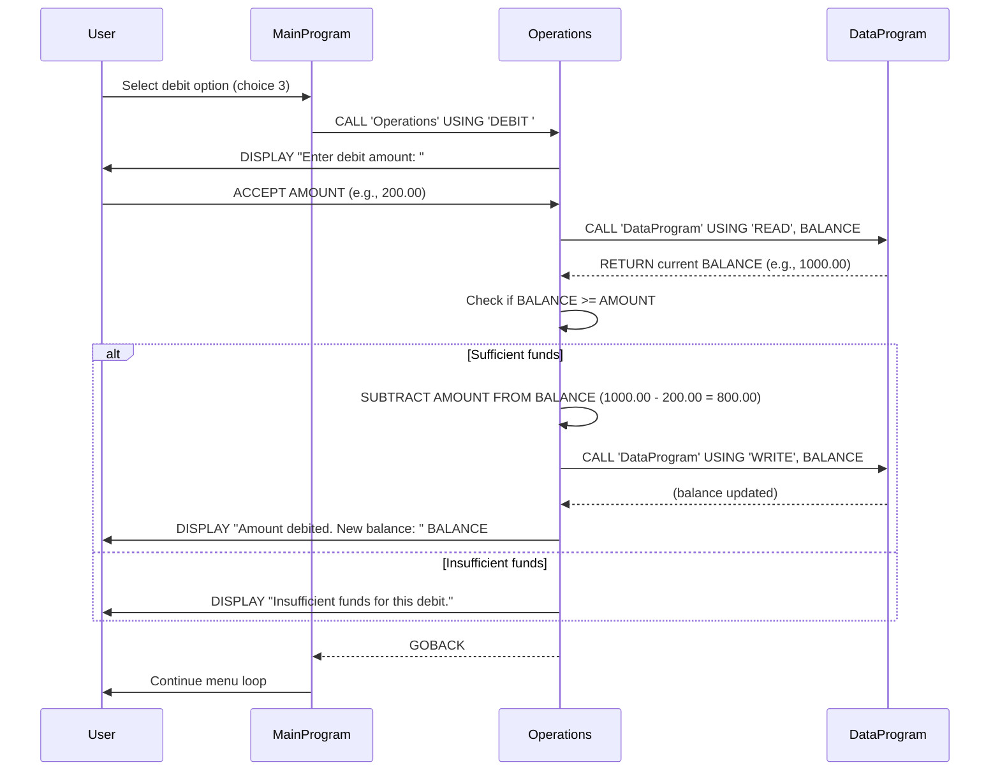

# COBOL Student Account Management System

This project contains a legacy COBOL system for managing student accounts. The system allows viewing account balances, crediting accounts, and debiting accounts with appropriate business rules.

## COBOL Files Overview

### data.cob
**Purpose:** Data management program responsible for persistent storage and retrieval of account balance information.

**Key Functions:**
- Stores the current account balance in working storage (initialized to $1000.00)
- Provides read/write operations for balance data
- Acts as a data layer abstraction for balance operations

**Parameters:**
- `PASSED-OPERATION`: Operation type ('READ' or 'WRITE')
- `BALANCE`: Balance value for read/write operations

### main.cob
**Purpose:** Main entry point and user interface for the account management system.

**Key Functions:**
- Displays interactive menu for account operations
- Handles user input and choice validation
- Routes operations to the appropriate subprograms
- Manages program flow and exit conditions

**Menu Options:**
1. View Balance - Displays current account balance
2. Credit Account - Adds funds to the account
3. Debit Account - Subtracts funds from the account
4. Exit - Terminates the program

### operations.cob
**Purpose:** Business logic layer handling all account operations and validations.

**Key Functions:**
- **View Balance:** Retrieves and displays current balance
- **Credit Operation:** Accepts credit amount and updates balance
- **Debit Operation:** Accepts debit amount with validation and updates balance

**Parameters:**
- `PASSED-OPERATION`: Operation type ('TOTAL ', 'CREDIT', or 'DEBIT ')

## Business Rules for Student Accounts

1. **Initial Balance:** All student accounts start with a balance of $1000.00
2. **Credit Operations:** Students can add any positive amount to their account balance
3. **Debit Operations:** Students can only debit amounts that do not exceed their current balance
   - If debit amount exceeds balance, operation is rejected with "Insufficient funds" message
4. **Balance Validation:** System prevents negative balances through debit validation
5. **Data Persistence:** Balance changes are immediately persisted through the data layer

## System Architecture

The system follows a modular design with three main components:
- **Main Program:** User interface and program control
- **Operations Program:** Business logic and validation
- **Data Program:** Data storage and retrieval

This separation allows for maintainable code and clear separation of concerns in the legacy COBOL system.

## Sequence Diagram

The following sequence diagram illustrates the data flow for a typical debit operation in the student account management system:

